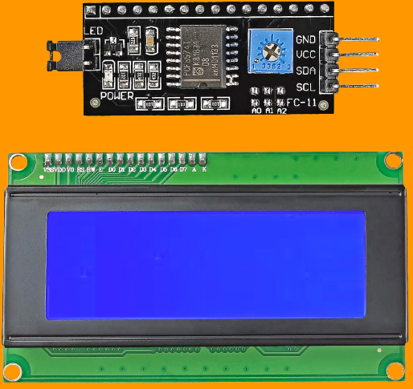
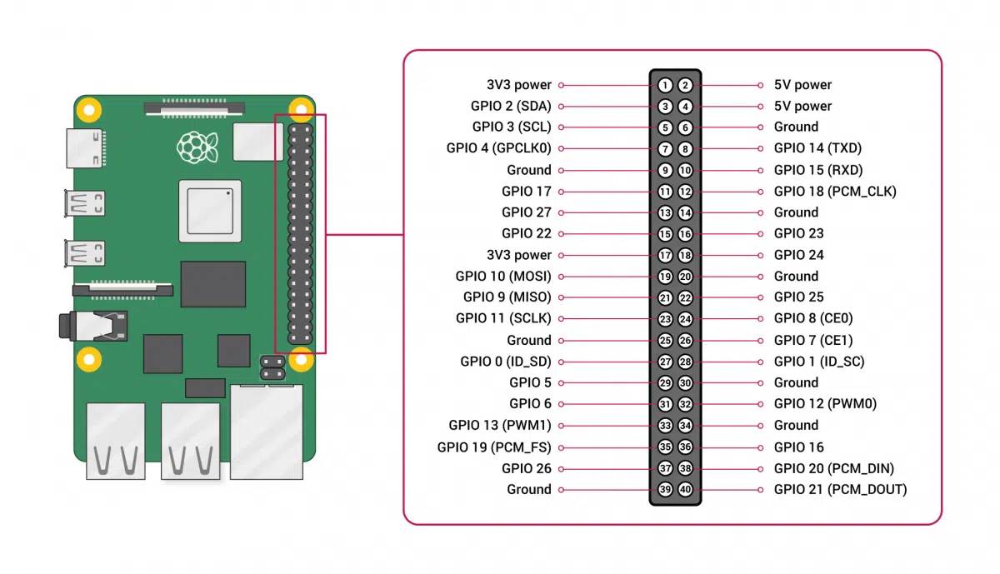
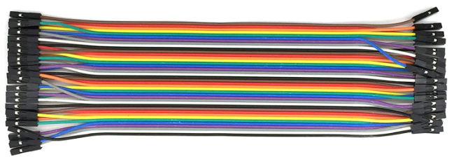
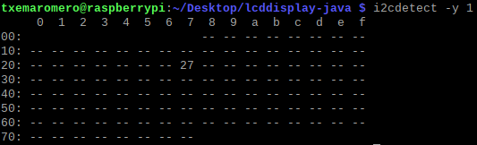
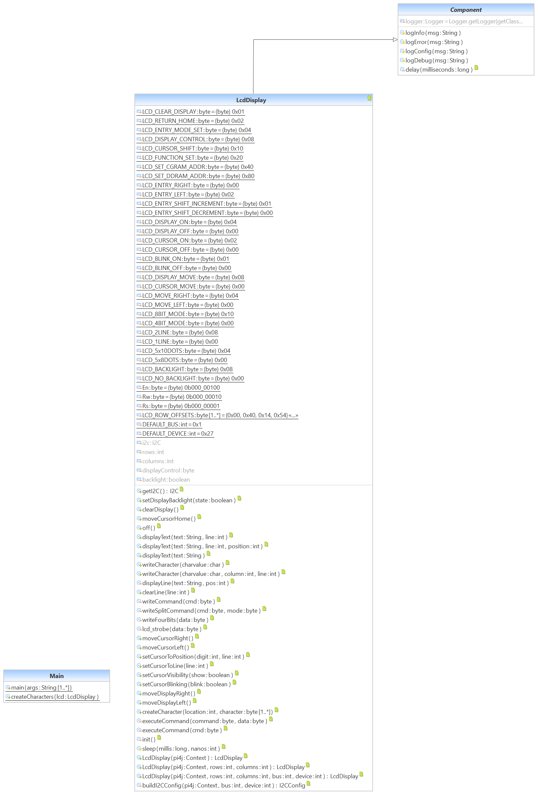
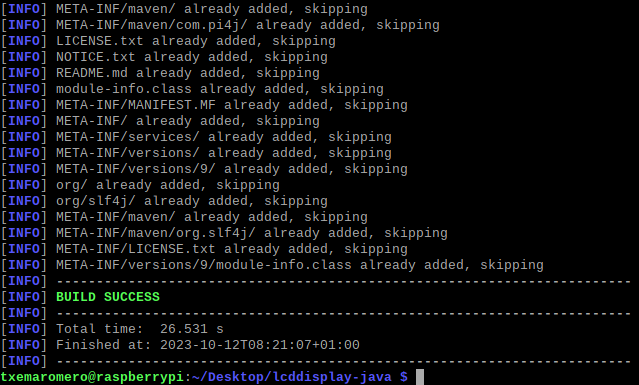
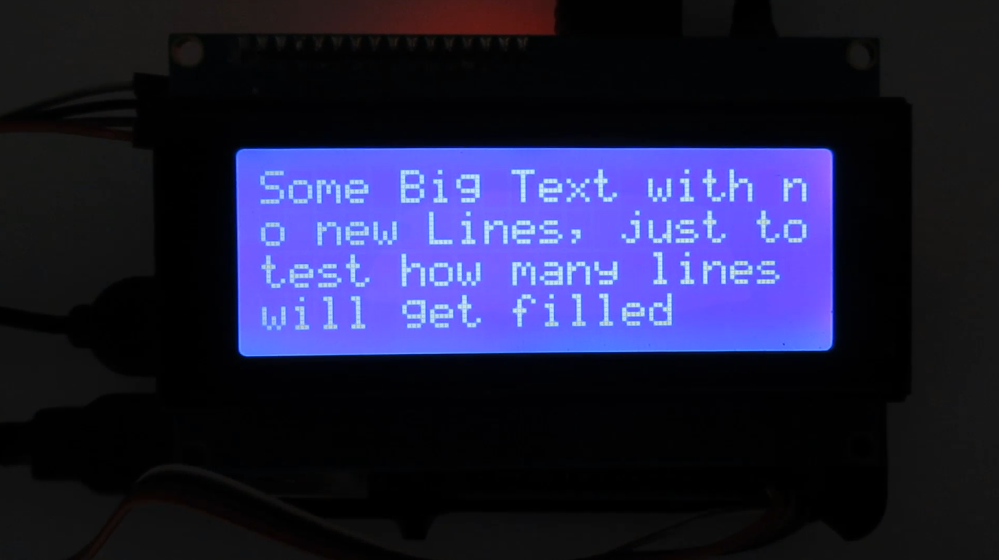

# lcddisplay-java

LCD display I2C with Java and embedded platforms

## Application context

LCD (Liquid Crystal Display) I2C (Inter-Integrated Circuit) is an easy-to-use display module, which can make displaying text easier. Using this module can reduce difficulties faced by makers, so they can focus on their core work. It is a serial communications protocol similar to UART (Universal Asynchronous Reception and Transmission). However, it is not used for PC-device communication but instead with modules and sensors. The advantage of an LCD I2C is that the wiring is straightforward. It is a simple, bidirectional two-wire synchronous serial bus and requires only two wires to transmit information between devices connected to the bus. See SDA (serial data line) and SCL (serial clock line) on the next figure. For example, a standard LCD requires over ten connections.



(Image source: SunFounder).

We will be using Java to program the LCD.


(Image source: Wikipedia).

## Instructions

### Enable I2C on the embedded platform, e.g, Raspberry Pi



(Image source: https://www.hwlibre.com).

This scheme is valid for Raspberry Pi version 4, 3 and Zero. The connections with I2C module are:

I2C module - Raspberry Pi  
GND - Ground  
VCC - 5V power  
SDA - GPIO 2 (SDA)  
SCL - GPIO 3 (SCL)  

Use 4 female-female connectors:



(Image source: DuPont).

Before we get into the programming, we need to make sure the I2C module is enabled on the Raspberry Pi and install a couple of tools that will make it easier to use I2C.

### Enable I2C in raspi-config

Most people know that you can enable the I2C port using raspi-config.

raspi-config [raspi-config 23] also offers a non-interactive mode, where you can drive it's functionality using command line parameters to it.

Here is how to read the current state of the I2C port:

```
raspi-config nonint get_i2c
```

This command will return:

* 1 if the port is disabled.
* 0 if the port is enabled.

Here is how to enable the I2C port:

```
sudo raspi-config nonint do_i2c 0
```

Again, note that 0 means true / on here.

Here is how to disable the I2C port:

```
sudo raspi-config nonint do_i2c 1
```

1 means "false" or off for this purpose.

Reboot the Raspberry Pi to activate the settings.

### Install I2C-tools

Now we need to install a program called I2C-tools, which will tell us the I2C address of the LCD when it is connected to the Raspberry Pi. So, at the command prompt, enter:

```
sudo apt-get install i2c-tools
```

Now reboot the Raspberry Pi and log in again. With your LCD connected, enter:

```
i2cdetect -y 1
```

at the command prompt. This will show you a table of addresses for each I2C device connected to your Raspberry Pi.



### Programming the LCD with Java

We will be using Java [W3Schools 23] to program the LCD.

We have provided the UML class diagram.



Supported display-dimensions are 40x2, 20x4 (our case), 20x2, 16x2, 16x1.

Java can be used in the Raspberry Pi with the JDK (Java Development Kit) package which is available in the default repository of the Raspberry Pi [Flurry 21]. The Pi4J project is prioritizing focus on providing Java programs access, control and communication with the core I/O capabilities of the Raspberry Pi platform [Pi4J 23].

This Pi4J V2 codebase can be built using Apache Maven 3.6.x. and JDK 11. Pi4J V2 also includes native libraries that will need to be compiled if you are modifying any native code. Most users will never need to compile the native libraries as these artifacts are automatically downloaded when building the Pi4J jars from Maven repositories.

Download the files as a zip using the green button, or clone the repository to your machine using Git.

Uncompress .zip file and type:

```
cd <uncompressed folder>
```

In:  
[lcddisplay-java/src/main/java/lcddisplay/LcdDisplay.java](src/main/java/lcddisplay/LcdDisplay.java) file, there are a couple of things you may need to change in the code, depending on your set up. On line 61 there is a function that defines the port for the I2C bus (`DEFAULT_BUS = 0x1`). Older Raspberry Pi's used port 0, but newer models use port 1. So, depending on which Raspberry Pi model you have, you might need to change this from 1 to 0.
Next, put the I2C address of your LCD in line 62 of the library code. For example, our I2C address is 27, so we will change line 62 to `DEFAULT_DEVICE = 0x27`.

In:  
[lcddisplay-java/src/main/java/lcddisplay/Main.java](src/main/java/lcddisplay/Main.java) file, put the number of ROWS and COLUMNS of the device in line 37.

In:  
lcddisplay-java/ folder

At the command prompt, enter:

```
apt-get install maven
```

```
mvn clean package
```



### Write to the LCD

Execute .jar Java file. At the command prompt, enter:

```
java -jar target/lcddisplay-0.0.1-SNAPSHOT-jar-with-dependencies.jar
```



## References:

[Flurry 21] G. Flurry. "Java on the Raspberry Pi: Develop Java Programs to Control Devices for Robotics, IoT, and Beyond". Apress. ISBN-13: 978-1-4842-7263-3. 28 September 2021.

[Pi4J 23] Pi4J. "Documentation". Project Website. December 2023.  
Available at: https://pi4j.com

[raspi-config 23] Raspberry Pi. "The raspi-config Tool". December 2023.  
Available at: https://www.raspberrypi.com/documentation/computers/configuration.html

[VS Code 23a] Microsoft. "Running Visual Studio Code on Raspberry Pi OS". Visual Studio Code IDE. December 2023.  
Available at: https://code.visualstudio.com/docs/setup/raspberry-pi

[VS Code 23b] Microsoft. "Managing Java Projects in VS Code". Visual Studio Code IDE. December 2023.  
Available at: https://code.visualstudio.com/docs/java/java-project

[W3Schools 23] W3Schools. "Java Tutorial". Online Web Tutorials. December 2023.  
Available at: https://www.w3schools.com/java/
